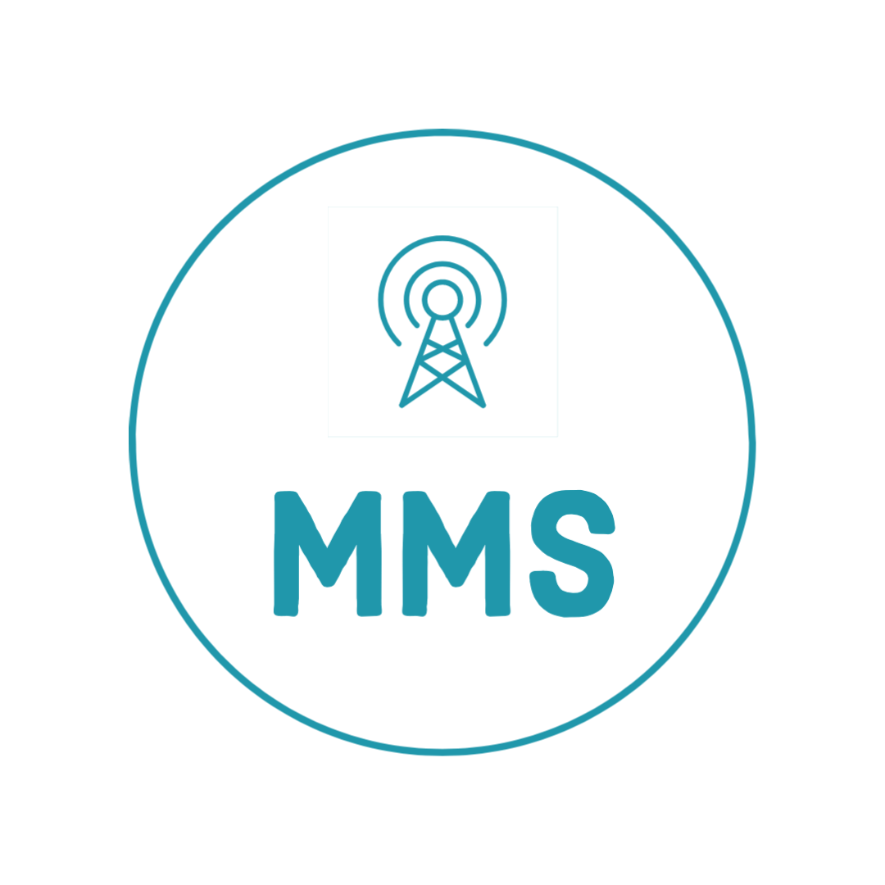
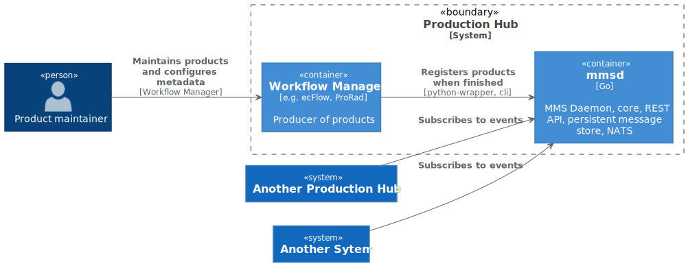

Documentation of the Met Messaging System.

**See Also:**

* [Terminology](terminology.md)
* [Messages](messages.md)
* [Client Commands](client_commands.md)
* [Decisions Taken](decisions_taken.md)
* [Coding Conventions](conventions.md)

## Terminology

### Production Hub

A unit that has the capacity to run custom code to process data and provide metadata, metrics and emits messages about events.
An example is an instance of ecFlow accompanied by an mmsd (MMS daemon).

### mmsd

A process providing metadata about the production hub it represents.

## Architecture (C4)

### Context

### Container

#### Container diagram for Production Hub

<!-- The Plantuml proxy gives an error for this one as of 2020-01, replacing it with an inline svg. --!>
<!--  -->

### Component

### Code for py-mms

## MMS Clients

The main program is written in Go, found at https://github.com/metno/go-mms.
Also under development is a Python client at https://github.com/metno/py-mms.
