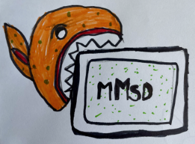
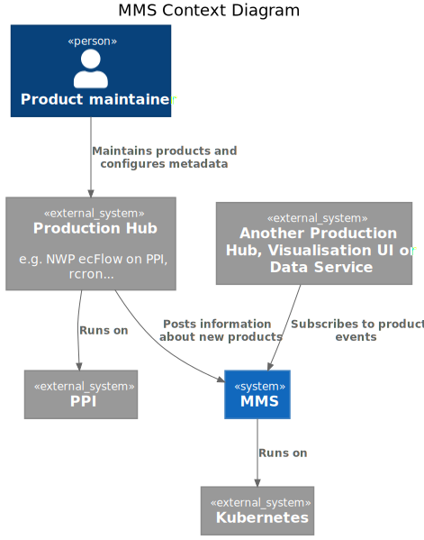
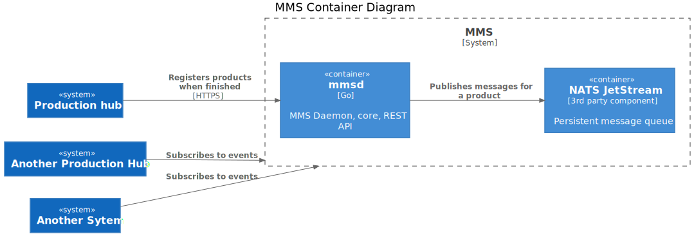
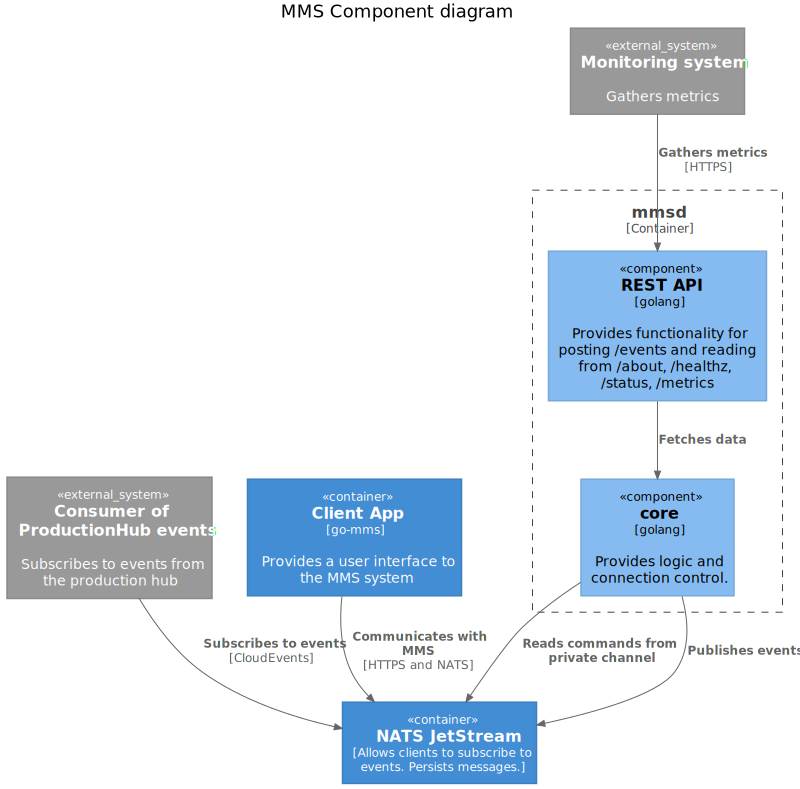

Documentation of the Met Messaging System.

**See Also:**

* [Terminology](terminology.md)
* [Messages](messages.md)
* [Client Commands](client_commands.md)
* [Decisions Taken](decisions_taken.md)
* [Coding Conventions](conventions.md)

## Terminology

### Production Hub

A unit that has the capacity to run custom code to process data generate metadata and post information about it to MMS
An example is a VM producing files, ecFlow instance or rcron job.

### mmsd 

A process providing REST interface to submit product information, status and metrics.

## Architecture (C4)

To address operational limitations, different architecture has originally been used, see [Legacy Architecture](legacy.md)

### Context

### Container

### Component

## MMS Clients

The main program is written in Go, found at https://github.com/metno/go-mms.
Also under development is a Python client at https://github.com/metno/py-mms.
